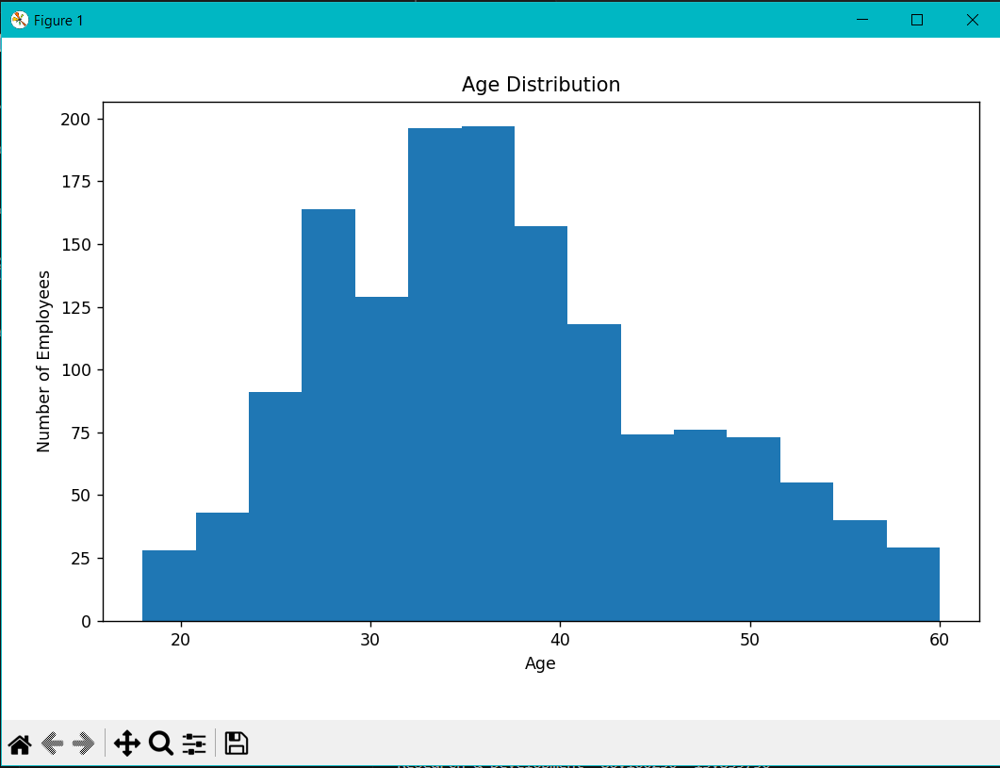
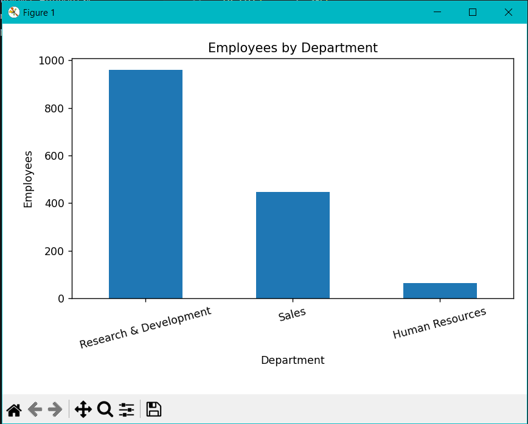
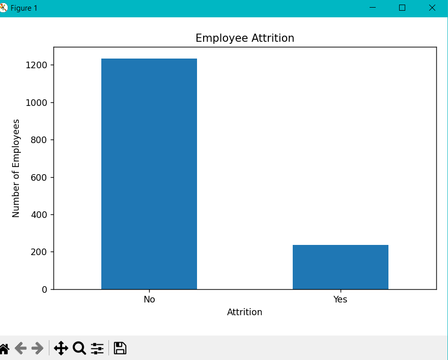
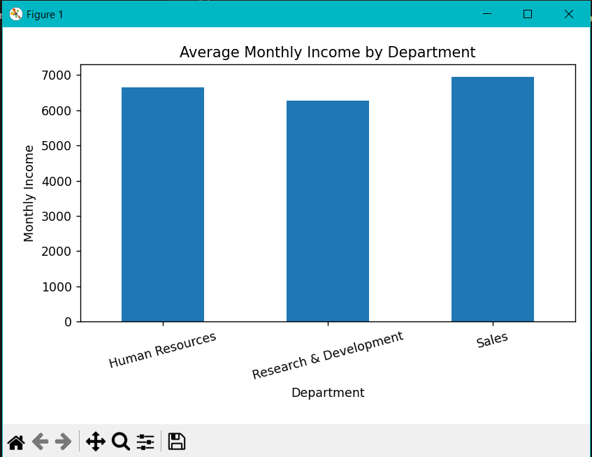

# HR Employee Attrition Analysis

## Overview

This project analyzes the IBM HR Employee Attrition dataset using Python and Pandas.

## Tools

- Python
- Pandas
- Matplotlib

## Analysis Performed

- Dataset overview
- Missing value check
- Employee attrition analysis
- Department analysis
- Average monthly income
- Age distribution
- Attrition rate by department

## Dataset

IBM HR Analytics Employee Attrition Dataset

